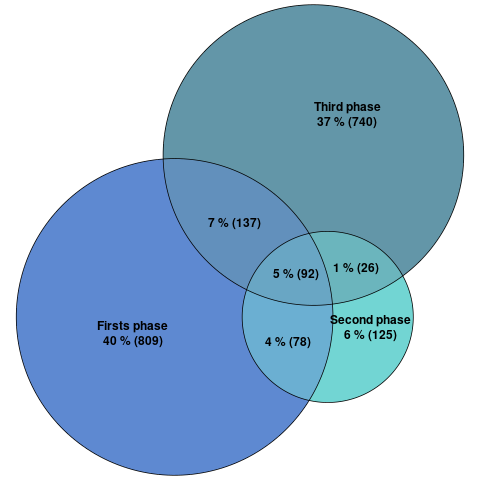
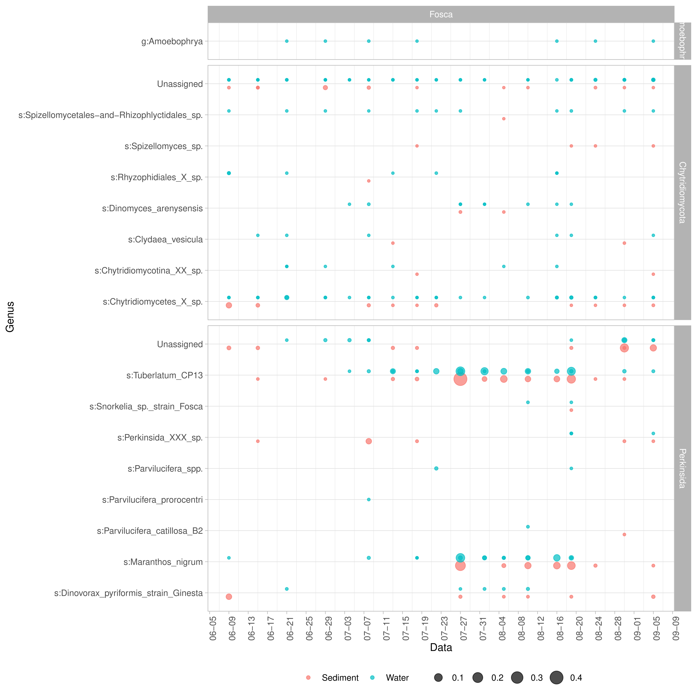

This pipeline contains a pipeline for a metagenomic analysis using phyloseq package from R.


## Libraries used in al pipeline
<details><summary>All the libraries</summary>
<p>
	
```{.r}
library(ggforce)
library(fantaxtic)
library(yingtools2)
library(dplyr)
library(ape)
library(reshape)
library(phyloseq)
library(ggpubr)
library(data.table)
library(vegan)
library(pairwiseAdonis)
library(ggplot2)
library(reshape2)
library(grid)
library(gridExtra)
library(ranacapa)
library(devtools)
source_url("https://raw.githubusercontent.com/obigriffith/biostar-tutorials/master/Heatmaps/heatmap.3.R")
library("gplots")
library("devtools")
library("DESeq2")
library("ampvis")
library("ampvis2")
library(metagMisc)
library(VennDiagram)
library("corrplot")
library(ggrepel)
library(dplyr)
library(ggalluvial)
library("ggh4x")
library(ggalluvial)
library(tidyr)
```
</p>
</details>

## Load the data
```{.r}
OTUtable_file <- read.table("data/asv_table.tbl", row=1, header=TRUE,sep="\t")
OTUtable <- otu_table(OTUtable_file, taxa_are_rows=TRUE)
file_metadata <- read.csv("data/metadata.csv", header=TRUE, row.names=1, sep=",")
metadata = sample_data(data.frame(file_metadata))
file_taxa <- read.table("data/taxonomy.tbl", header=TRUE, row.names=1) 
taxa_tmp <- as.matrix(file_taxa)
TAXtable = tax_table(taxa_tmp)

physeq_object  = merge_phyloseq(OTUtable,metadata,TAXtable)
```
### Modify data
#### If you need to change a specific taxa name.
```{.r}
tax_table(phyloseq_object)["asvXX", "Level_x"] <- "new_name"
```
#### If you need to delete samples by the metadata. 

```{.r}
physeq_v2 = subset_samples(physeq_object, column_name != "variable")
```
#### Merge data, by variable in sample_data.
```{.r}
merged_ps <- merge_ps_samples(physeq_object, grouping = "Variable")
```
<details><summary> Click to see the code of the function "merge_ps_samples"</summary>
<p>

```{.r}
require(phyloseq)
require(tidyverse)

# Concatenate unique values in a vector
concat_unique <- function(vec){
  uniq <- unique(as.character(vec))
  return(paste(uniq, collapse = "/"))
}

# Like psmelt, but only uses the otu_table and sample_data
ps_semi_melt <- function(ps){
  otu_table(ps) %>%
    data.frame(taxid = row.names(.)) %>%
    rename_with(function(x){gsub("X", "", x)}) %>%
    pivot_longer(!taxid, names_to = "sample_id", values_to = "abundance") %>%
    left_join(sample_data(ps) %>%
                data.frame(sample_id = row.names(.)),
              by = "sample_id")
}

# Function that summarizes a vector based on its class
summarise_vec <- function(vec){
  if(class(vec) %in% c("numeric", "integer", "logical")){
    return(mean(vec, na.rm = T))
  } else if (class(vec) %in% c("factor", "character")){
    return(concat_unique(vec))
  } else {
    stop("Error: unknown column type")
  }
}

# Converts a summary df to an otu_table
summ_to_otu_tbl <- function(summ){
  summ %>% 
    select(taxid, sample_id, abundance) %>% 
    pivot_wider(names_from = "sample_id", values_from = "abundance") %>%
    column_to_rownames('taxid') %>%
    as.matrix() %>%
    otu_table(, taxa_are_rows = TRUE)
}

# Converts a summary df to sample_data
summ_to_sample_dat <- function(summ){
  summ %>% 
    select(!c(taxid, abundance)) %>% 
    unique() %>%
    column_to_rownames('sample_id') %>%
    sample_data()
}

# Function that merges phyloseq samples based on the names of one or more grouping factors
# present in sample_data(ps)
merge_ps_samples <- function(ps, grouping){
  
  # Make sure taxa are rows
  if (!phyloseq::taxa_are_rows(ps)) {
    otu_table(ps) <- phyloseq::otu_table(t(otu_table(ps)), taxa_are_rows = T)
  }
  
  # Convert to long format
  ps_long <- ps_semi_melt(ps)
  
  # Summarise all columns
  summ <- ps_long %>%
    group_by(across(all_of(!!grouping))) %>%
    group_by(taxid, .add = T) %>%
    summarise(across(everything(), summarise_vec)) %>%
    ungroup()
  
  # Convert to otu_table and sample_data
  otu_tbl <- summ_to_otu_tbl(summ)
  sample_dat <- summ_to_sample_dat(summ)
  
  # Create new physeq object
  new_ps <- phyloseq(otu_tbl, sample_dat, tax_table(ps))
  return(new_ps)
}

```
</p>
</details>

#### Transform data for plot by axis_sec (ggplot2)
Easy way, multiple or divide.

```{.r}
data$varible_adjust <- data$variable /10
ggplot(......)+
	scale_y_continuous(sec.axis = sec_axis(~ . *10, name = "Label"))
```
Change scale and breaks.
```{.r}
#25<- ymax axis y
#12<- ymin axis y
#38.5 <- ymax sec_axis y
#37.5 <- ymin sec_axis y

data$varible_adjust<- ifelse(data$variable > 25, 
                                data$variable * ((25 - 12) / (38.5 - 37.5)), 
                                data$variable)
ggplot(......)+
	scale_y_continuous(sec.axis = sec_axis(~ ((. - 12) * (38.5 - 37.5) / (25 - 12)) + 37.5, name = "Label"))
```
## Alpha & Beta diversity

In this example we want to compare the alpha diversity between the variable "Depth".
In this example we compare the betadiversity and mark each sample with 3 variables.


<details><summary> Click to see the code</summary>
<p>

```{.r}
## Ordre of the Variable
newSTorder = c("0", "5", "10","20", "40","60", "75")

## Make the pairs comparisons, with depth variable
compare_depth <- combn(levels(sample_data(physeq_object)[,"Depth"]$Depth)[-9],2,
                    simplify=FALSE)

## Alpha diversity by Depth and Sampling
# If you want to add several samples in each Depth category change the variable in the parameter "x".

plot<-plot_richness(physeq_object, color = "Depth", x="Depth" ) + geom_boxplot()
plot$data$Depth <- factor(plot$data$Depth, levels=newSTorder)

## Create the plot
png("graph/alfa_diversity_depth.png",height=1200,width=2000,res=150)
plot
dev.off()
```
</p>
</details>

#### Beta diversity

The input is a phyloseq object with data normalize and delete the samples with no ASV's. (This happens when you select a specific taxonomy)


<details><summary>Click to see the code</summary>
<p>

You can change the color and the shape of each point, and add a label.

```{.r}
bray_phyloseq = ordinate(phyloseq_normalize, "NMDS", "bray", weighted = TRUE)
stressplot(bray_phyloseq)

p.bray = plot_ordination(phyloseq_normalize, bray_phyloseq, color = "Variable1", shape= "Variable2",
 	 title = "NMDS of Bray-Curtis distance") + geom_text(mapping = aes(label = Varible3 ), size = 3, vjust = 1.5)
```
</p>
</details>

## Uppset plot

It's a graph to visualize intersections of multiple sets compared to the traditional approaches, i.e. the Venn Diagram.

Complete inforamation: https://jokergoo.github.io/ComplexHeatmap-reference/book/upset-plot.html


<details><summary>Click to see the code</summary>
<p>

#### Prepare the data from pyloseq object
```{.r}
#Delete the singeltons. Delete the ASV's only have 1 sequence.

physeq_single <- filter_taxa(physeq_object, function (x) {sum(x > 0) > 1}, prune=TRUE)

#Extract the transpose ASV's table
physeq_asvtable<-t(otu_table(physeq_single))

#Extract the metadata
physeq_metadata <- data.frame(phyloseq::sample_data(physeq_single), 
                       check.names = FALSE
		       )

#Create the ASV's list from each group that we want show. One for each group:
ASVlist_physeq_groupA = colnames(physeq_asvtable[physeq_metadata$Variable == "A", 
			apply(physeq_asvtable[physeq_metadata$Variable == "A",], MARGIN=2, function(x) any(x >0))])

#To create automatically the previous step:
#Create a vector with all the group of the variable
list<-levels(metadata_elu$Varible)

#Make one variable for each group
for (group in list) {
    name<-paste("ASVlist_phyloseq_", group, sep="")
    assign(name, colnames(physeq_asvtable[physeq_metadata$Variable == group, apply(physeq_asvtable[physeq_metadata$Variable == group,], MARGIN=2, function(x) any(x >0))]))
}

#Create the data for the graph
data_upset = list(A=ASVlist_physeq_groupA,B=ASVlist_physeq_groupB)

#To create automatically the previous step:
data_upset<-""
for (group in list) {
    name<-paste("ASVlist_phyloseq_", group, sep="")
    to_add= paste(group,"=",name, sep="")
    data_upset<-c(data_upset,to_add )
}

#Calculate all combinations
combinations_upset = make_comb_mat(data_upset)
```
#### Create the graph

Variables to change:
* 120 <- minimum of interactions to show.
* ylim <- te minimum and max of the total asv by sample.

```{.r}
#Create the graph
upset_graph<-UpSet[comb_size(combinations_upset) >= 120],comb_order = rev(order(comb_size(combinations_upset[comb_size(
	    combinations_upset) >= 120]))),right_annotation = upset_right_annotation(combinations_upset,
	    ylim = c(0, 6000)),width = unit(ifelse(1,20), "cm") )

##Paramters of the graph
ss_upset = set_size(combinations_upset[comb_size(combinations_upset) >= 120])
cs_upset = comb_size(combinations_upset[comb_size(combinations_upset) >= 120])
od_upset = column_order(upset_graph)

##Make graph
png("graph/upset_graph.png",height=1200,width=2600,res=150)
ht = draw(upset_graph)
decorate_annotation("Intersection\nsize", {
    grid.text(cs_upset[od_upset], x = seq_along(cs_upset), y = unit(cs_upset[od_upset], "native") + unit(4, "pt"), 
        default.units = "native", just = c("center", "bottom"), 
        gp = gpar(fontsize = 8, col = "#404040"), rot = 0, )
})
dev.off()
```
### Another option
Direct from the phyloseq object:
```{.r}
library(MicrobiotaProcess)
upsetda <- get_upset(obj=physeq_object, factorNames="Group")
upset(upsetda, sets=unique(as.vector(sample_data(physeq_object)$Group)), 
      sets.bar.color = "#56B4E9",
      order.by = "freq", 
      empty.intersections = "on"
```
	
</p>
</details>
## Barplot

Make barplots with a phyloseq object is dificult if you want to join samples, because the  merge_samples function sum the ASV's table numbers, don't do the mean.
The solution is work with dtaframes, and make the plot with ggplot2.


<details><summary>Click to see the code</summary>
<p>

The input is a phyloseq object normalized. physeq_norm

```{.r}
#Join all the data in one varible (ASV's table, metadata & taxa
 data <- psmelt(physeq_norm)
#Convert the varible Spece to character, or the taxa level interest
 data$spe <- as.character(data$Level_8)
#Create a dataframe, columns: interest variables & all taxonomy
 Spec_abundance <- aggregate(Abundance~Sample+Level_8+Variable1+Variable2+VariableN, data, FUN=sum)
 abund_table2 <- cast(Spec_abundance, Sample+Variable1+VariableN ~ Level_8)
# Choose the rownames(Sample)
 rownames(abund_table2)<-abund_table2[,1]
#Create a vector and transform to a dataframe all the variables, except the taxonomy.
 vector<-abund_table2[,1:3] 
 vector<- as.data.frame(vector)
#Delete the no taxonomy columns, and sort by decreasing order
 x<-abund_table2[,-1:-3]/rowSums(abund_table2[,-1:-3]) 
 x<-x[,order(colMeans(x),decreasing=TRUE)]
#N: Number of taxa we want to plot
 N<-20
#Extract the taxa names to plot
 taxa_list<-colnames(x)[1:N]
#Delete if there are a Unassingnable/Unknown taxa
 taxa_list<-taxa_list[!grepl("Unassignable",taxa_list)]
#Extract the lenght taxa
 N<-length(taxa_list)
#Create data frame with the taxa interest and other
 new_x<-data.frame(x[,colnames(x) %in% taxa_list],Others=rowSums(x[,!colnames(x) %in% taxa_list])) 
 new_x<-setDT(new_x, keep.rownames = "Sample")[]
#Add the variables of interest
 new_x <- merge(new_x,vector,by="Sample")
#Create the data frame respect the interest varible(Variable1, and calcualte the mean.(21  depends of the number of taxa,  N+1,check new_x[,2:21] are all the taxa + other)
 new_y<-aggregate(new_x[,2:21], list(new_x$Variable1, mean
 )
#Melt dataframe for plot
 mydf.molten <- melt(new_y, value.name="Count", variable.name="Taxonomy", na.rm=TRUE)
#If you need change the order of the variable
 mydf.molten$Group.1 <- factor(mydf.molten$Group.1, levels= c("GroupA", "GroupB","GroupB"))

#Create the plot with ggplot2
 png("graph/barplot/v2/barplot_small_perkinsids.png",height=800,width=1400,res=150)
 ggplot(mydf.molten, aes(x=Group.1, y=Count, fill=Class))+geom_bar(stat="identity")
 dev.off()

```
</p>
</details>

## Heatmaps
The input to make a heatmap is a phyloseq object normalized.


<details><summary>Click to see the code</summary>
<p>

```{.r}
#Prepare the data.
#If ypu want only a certain number of taxa
physeq_norm_tmp = prune_taxa(names(sort(taxa_sums(physeq_norm), TRUE))[1:6], physeq_norm)
#Extract the ASV's table
data_table<-t(otu_table(physeq_norm_tmp))

# Change the name of the samples and and ASV by taxonomic level interest (Level_8)
setDT(file_taxa, keep.rownames = TRUE)[]
setDT(file_metadata, keep.rownames = TRUE)[]
colnames(data_table)=file_taxa$Level_8[match(colnames(data_table), file_taxa$rn)]
rownames(data_table)=file_metadata$graph_id[match(rownames(data_table), file_metadata$rn)]

# Create the columns colors with the labels of diferent variables. No limit
vector<-rownames(sample_data(physeq_norm))
vector1<-data.frame(vector,sample_data(physeq_norm)$Variable1)
vector2<-data.frame(vector,sample_data(physeq_norm)$Variable2)
vector3<-data.frame(vector,sample_data(physeq_norm)$Variable3)

new1<-gsub("GroupA", "#1e7e00ff", vector1$sample_data.physeq_norm..Variable1)
new1<-gsub("GroupB", "#88f864ff", new1)

new2<-gsub("GroupA", "#880000ff", vector2$sample_data.physeq_norm..Variable2)
new2<-gsub("GroupB", "#f40b0bff", new2)
new2<-gsub("GroupC", "#fc7700ff", new2)
new2<-gsub("GroupD", "#f1ff00ff", new2)
new2<-gsub("GroupE", "#ca9b00ff", new2)

new3<-gsub("GroupA", "#0c0eabff", vector3$sample_data.physeq_norm..Variable3)
new3<-gsub("GroupB", "#5de6ffff", new3)
new3<-gsub("GroupC", "#0c7aabff", new3)

#Prepare the columns
rlab=t(cbind(new1,new2,new3))
rownames(rlab)=c("Name_Variable1","Name_Variable2","Name_Variable3")

#Choose the rank color and number of diferents color in rank
colfunc <- colorRampPalette(c("#dbe2af", "#7a002d"))
col=colfunc(15)
#choose the function to the dendogram
mydist=function(c) {dist(c,method="euclidian")}
myclust=function(c) {hclust(c,method="average")}

#Create the heatmap graph.
png("graph/heatmap_L8.tax.png",height=1800,width=1400,res=150)
heatmap.3 (as.matrix((data_table)), hclustfun=myclust, distfun=mydist, scale="none", dendrogram="row",
	  Rowv=TRUE, RowSideColors=rlab, col=colfunc(15), key=FALSE, lwid = c(0.2,1), lhei = c(0.3,1),
	  margins=c(18,7),na.color = "white",main="Dinos taxonomy",cexCol=1.5)
	  
legend ("top", legend = c("GroupA", "GroupB", "", "GroupA", "GroupB", "GroupC",
       "GroupA", "GroupB", "GroupC", "GroupD", "GRoupE"),
       fill = c("#1e7e00ff", "#88f864ff", "white", "#5de6ffff", "#0c7aabff",
       "#0c0eabff", "#880000ff", "#f40b0bff", "#fc7700ff", "#f1ff00ff","#ca9b00ff"),
       border=FALSE, bty="n", y.intersp = 1, cex=1,ncol=2)
dev.off()

```
</p>
</details>

## IndVal
Calculates the indicator value (fidelity and relative abundance) of species in clusters or types.

To see if there are significance diference between groups, first calculate ANOSIM, to explore if there are diference betwwen groups. If this results is positive, the next step is explore if there any speceies that explain the groups individually, with the IndVal indicator.

The output could be the value of the index or you can make a graph


<details><summary>Click to see the code</summary>
<p>

```{.r}

#Calculate ANOSIM
#The input is a phylosep normalize with the taxonomy we want to test, and the Variable1 is the grouping variable.
data_anosim<-get_variable(physeq_tax_norm, 'Variable1')
anosim_variable <-anosim(phyloseq::distance(physeq_tax_norm, "bray", weighted=FALSE),data_anosim)

#Calcualte the ANOSIM by pairs
list<-levels(sample_data(physeq_tax_norm)$Variable1)
for (group in list) {
    for (i in 2:length(list)-1){
        for (j in (i+1):length(list)-1){
 	    cat ("Anosim with the groups:",(list[i]),(list[j+1]),"\n")
 	    vec<-c(list[i], list[i+1])
 	    physeq_pair<-subset_samples(physeq_tax_norm, Variable1 %in% c(vec))
 	    data_anosim<-get_variable(physeq_pair, 'Varaible1')
 	    anosim_pair <-anosim(phyloseq::distance(physeq_pair, "bray", weighted=FALSE),data_anosim , permutations = 999)
	    print(anosim_pair)
	}
    }
}


#Calculate IndVal
#Extract the sample data, transform rownames to column, extract a data frame with sample names & Varible to group.
inf<-sample_data(physeq_norm)
inf$samples<-rownames(inf)
info_group<-cbind(inf$samples, inf$Variable1)
info_group<-data.frame(info_group)

#Exrtact the ASV's table
ASV_table<-t(otu_table(physeq_morm))

#Calculate IndVal
iva<-indval(ASV_table, info_group$X2)

#Select and order by IndVal index
gr <- iva$maxcls[iva$pval<=0.05]
iv <- iva$indcls[iva$pval<=0.05]
pv <- iva$pval[iva$pval<=0.05]
fr <- apply(samples[,-1]>0, 2, sum)[iva$pval<=0.05]
indvalsummary <- data.frame(group=gr, indval=iv, pvalue=pv, freq=fr)
indvalsummary <- indvalsummary[order(indvalsummary$group, -indvalsummary$indval),]

#Make graph
#Extract the info &  convert rownames to column
infoind<-indvalsummary
setDT(infoind, keep.rownames = TRUE)[]
#If you want to change the name of the ASV
infoind$rn <- revalue(infoind$rn, c("asvXXX"= "asvXXX: specie taxonomic name"))
#If you want to change the name of the groups. (this inforamtion is in info_group and inf$Variable1)
infoind$group<-c("Group1","Group1","Group2","Group2","Group2","Group3","Group4","Group3","Group5","Group5")

#Create graph
png("graph/indval.png",height=1200,width=1200,res=180)
ggplot(infoind, aes(x=indval, y=rn)) +scale_color_manual(values = allGroupsColors.indval)+
  geom_segment( aes(y=rn, yend=rn, x=0, xend=indval), color="grey") +
  geom_point( aes(colour = factor(group)), size=6) +
  theme_light() +
  theme(
    axis.text=element_text(size=12),
    panel.grid.major.x = element_blank(),
    panel.border = element_blank(),
    axis.ticks.x = element_blank()
  ) +
  xlab("indval") +
  ylab("Taxonomy")+  labs(colour = "Variable1")

dev.off()

```
</p>
</details>


## Rarefaction curves

Rarefaction is a technique to assess species richness from the results of sampling. Rarefaction allows the calculation of species richness for a given number of individual samples, based on the construction of so-called rarefaction curves. This curve is a plot of the number of species as a function of the number of samples. Rarefaction curves generally grow rapidly at first, as the most common species are found, but the curves plateau as only the rarest species remain to be sampled.


<details><summary>Click to see the code</summary>
<p>

```{.r}

# Calculate the cures for each samples.
Parameters:
 * step: Step Size for sample size in rarefaction curves
 * se : default 'TRUE'. Logical. Should standard errors be calculated.
 * xlim: Ddelimitate the x axis.


rare_par<-ggrare(physeq_object, step=10, plot=TRUE)+ xlim(0, 500)

png("graph/rarefaction_curve.png",height=1200,width=1200,res=180)
rare_par
dev.off()
```
</p>
</details>

## Boxes, treemap.

A treemap is a space-filling visualization of hierarchical structures. To take acount that represents medians of a group of samples.
The input to make a treemap/boxes is a phyloseq object normalized and glom (join the asv with the same taxa in the interest taxa level, and join the samples with goups we want to compare, (Location, Bloom, Year...)


<details><summary>Click to see the code</summary>
<p>

```{.r}

#Transform the data
#Extract the asv table
table_physeq_norm_glom_group<-(otu_table(physeq_norm_glom_group))

#Recover the taxa names
setDT(file_taxa, keep.rownames = TRUE)[]
colnames(table_physeq_norm_glom_group)=file_taxa$Level_8[match(colnames(table_physeq_norm_glom_group), file_taxa$rn)]

#For change the names manually
# See the default names
colnames(table_physeq_norm_glom_group)
#Change the names
colnames(table_physeq_norm_glom_group)[1]  <-"New name for taxa 1"
colnames(table_physeq_norm_glom_group)[2]  <-"New name for taxa 2"
colnames(table_physeq_norm_glom_group)[6]  <-"New name for taxa 6"       

#Transform to data frame
table_tree<-as.data.frame.table(table_physeq_norm_glom_group)

# Create the graph
## Index: variable/s for agregation, in order. (Var1, Var2)
## vSize: variable that specifies the sizes of the rectangles. (Freq)
## vColor: variable that  determines the colors of the rectangle. (Var2)


png(filename="graph/tree.png",width=2000, height=1200, res=150)

treemap(,
            index=c("Var1","Var2"),
            vSize="Freq",
	    vColor="Var2",
	    fontface.labels =c("italic","italic","italic"),
            type="categorical",
	    #title="Title graph",
	    align.labels = list(c("center", "top"), c("center", "center")),
	    palette="Set3",
	    title.legend="Title legend",
	    )
dev.off()

```
</p>
</details>

## LEfSe

LEfSe (Linear discriminant analysis Effect Size) determines the features (organisms, clades, operational taxonomic units, genes, or functions) most likely to explain differences between classes by coupling standard tests for statistical significance with additional tests encoding biological consistency and effect relevance.

Is necessary run python scripts in the terminal. The scrips are in: 
https://github.com/biofuture/MetaP/tree/master/bin/LEfSe

The input is a phyloseq object, glom at taxonomic level of interest.


<details><summary>Click to see the code</summary>
<p>

```{.r}

glom_physeq <- tax_glom(physeq_object, taxrank = "Level_8")

lefse.tbl <- lefse(glom_physeq, class= "variable_grouping",levels= "Level_8")
```

```console
# Terminal

sed 's/,/./g' lefse.txt > lefse.v2.tbl
python format_input.py lefse.v2.tbl lefse.level8_grouping.in -c1  -o -1000000
run_lefse.py  lefse.level8_grouping.in  lefse.level8_grouping.res -a 0.05 -w 0.05 -l 4.5 -e 0 -y 0 -s 0

# Parameters of format_input.py

# -c [1..n_feats]       set which feature use as class (default 1)
# -o float              set the normalization value (default -1.0 meaning no normalization)

# Parameters of run_lefse.py

# -a float        set the alpha value for the Anova test (default 0.05)
# -w float        set the alpha value for the Wilcoxon test (default 0.05)
# -l float        set the threshold on the absolute value of the logarithmic LDA score (default 2.0)
# -e int          set whether perform the wilcoxon test only among the
#                 subclasses with the same name (default 0)
# -y {0,1}        (for multiclass tasks) set whether the test is performed in
#                 a one-against-one ( 1 - more strict!) or in a one-against-
#                 all setting ( 0 - less strict) (default 0)
# -s {0,1,2}      set the multiple testing correction options. 0 no correction
#                 (more strict, default), 1 correction for independent
```

```{.r}

## Create the graph

out_lefse <- read.table(file ="lefse.level8_grouping.res", sep = "\t",na.strings="-")
out_lefse$taxon     <- out_lefse$V1
out_lefse$lda       <- out_lefse$V4
out_lefse$direction <- out_lefse$V3
out_lefse$p.value   <- out_lefse$V5
out_lefse$taxon     <- factor(out_lefsetaxon,
		       levels = out_lefse$taxon[order(out_lefse$direction, out_lefse$lda)])
out_lefse           <- out_lefse %>% filter(lda > 4.5)

png(paste("graph/lefse.png"),height=400,width=1400,res=150)
ggplot(out_lefse, aes(x = taxon, y = lda, fill = direction)) + geom_bar(stat = "identity") +
      coord_flip() + theme(legend.position = "bottom")
dev.off()

```
</p>
</details>

## Venn diagram
Make Venn diagram of shared taxa (ASVs, OTUs) across sample groups from a phyloseq object. 


```{.r}
#library
remotes::install_github("Russel88/MicEco")
library("MicEco")
ps_euler(physeq_object,"variable_compare", quantities = list(type=c("percent","counts"), font = 2), fill = c("#5e89d1","#72d5d3","#6396a8"), labels = list(cex = 1))
#extract list in common/unic
list_all<-ps_venn(physeq_object,"variable_compare",plot=FALSE)
vec_all3<-list_all$`Firsts phase__Second phase__Third phase`
tax_table <- tax_table(physeq_object)
install.packages("openxlsx")
library(openxlsx)	
write.xlsx(selected_taxonomy_para, file = "taxonomy_incomon_para.xlsx", rowNames = FALSE)
```
## Bubble 
The input is a dataframe, if it's a phyloseq object, glom at taxonomic level of interest, and psmelt.


<details><summary>Click to see the code</summary>
<p>

```{.r}
#Prepare data
glom_phyloseq<- tax_glom(phyloseq_object,  taxrank = "Level_XX", NArm=FALSE)
input_bubble <- psmelt(glom_phyloseq)

#Make plot
ggplot(input_bubble %>% filter(Abundance > 0), aes(x = Data, y = Interes, size = Abundance, color = Feature_1)) +
  	geom_point(alpha = 0.7, position = position_dodge(width = 0.5)) +
	scale_x_date(date_breaks = "4 days", date_labels = "%m-%d") +
   	facet_grid(Feature_2~Feature_3, scales="free", space = "free") + 
    	labs(title= "",x = "", y = "") +
  	theme_light() +
  	theme(legend.position="bottom",axis.text.x = element_text(angle = 90, hjust = 1), legend.title = element_blank(),
		panel.grid.major.x = element_blank(), panel.grid.minor.y = element_blank(), panel.grid.minor.x = element_blank())

```
</p>
</details>

## Others
Extract only 1 ASV by the identifier
```{.r}
physeq_asv111 <- subset_taxa(physeq_norm, "asv111", TRUE)
asv_names <- taxa_names(physeq_norm)
asv111_index <- which(otu_names == "asv111")
physeq_asv111 <- prune_taxa(otu_names[asv111_index], physeq_norm)
```
## ENVO codes
sea -> ENVO:00000016

marine biome -> ENVO:00000447

sea coast -> ENVO:00000303

artificial harbor -> ENVO:00000464 

Beach -> ENVO:00000091

